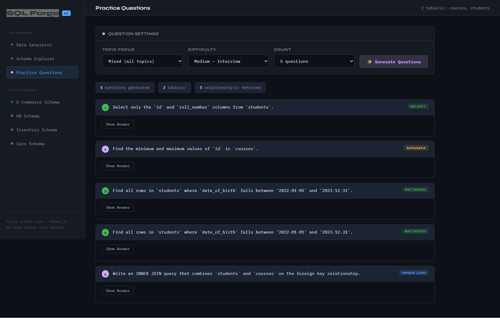

# SQL Forge ⚡

**A fully client-side SQL mock data generator and interview practice engine.**

No backend. No sign-up. No data leaves your browser.

🔗 **[Live Demo](https://your-username.github.io/sql-forge)**



---

## Features

### 🗄️ Multi-Table Data Generator
- Paste one or more `CREATE TABLE` statements and instantly get realistic `INSERT` SQL
- Supports **MySQL**, **PostgreSQL**, **SQLite**, and **SQL Server** dialects
- Generates up to 5,000 rows per table
- Powered by [Faker.js](https://fakerjs.dev/) — 35+ smart column heuristics:
  - Names, emails, phone numbers, addresses, countries
  - Companies, departments, job titles
  - Vehicle make/model/VIN/color/fuel type
  - UUIDs, IP addresses, URLs, user agents
  - ENUM values auto-sampled from type definitions
  - Smart numeric ranges for salary, price, mileage, ratings, lat/lon, and more

### 🔍 Schema Explorer
- Visual breakdown of every parsed table — column names, types, PK/FK badges
- Auto-detects foreign key relationships by `_id` naming convention
- Parses explicit `FOREIGN KEY ... REFERENCES` constraints
- Visual relationship diagram for all detected joins

### 📚 Practice Question Engine
- Rule-based, tailored to *your actual schema* — not generic templates
- **6 topics:** Basic SELECT, Aggregations, GROUP BY, JOINs, Subqueries, Window Functions
- **3 difficulty levels:** Easy (fundamentals) → Medium (interview) → Hard (senior/advanced)
- JOIN questions only appear when relationships are detected
- Window function questions: `RANK()`, `ROW_NUMBER()`, running totals with `PARTITION BY`
- Up to 10 questions per session, randomised from a deep pool

### 📦 Quick-Load Sample Schemas
- **E-Commerce** — customers, products, orders, order_items
- **HR** — departments, employees
- **Inventory** — warehouses, products, stock
- **Cars** — makes, cars

---

## Usage

### Option 1 — Open directly in browser
```
open index.html
```

### Option 2 — Serve locally
```bash
npx serve .
# or
python3 -m http.server 8080
```

### Option 3 — GitHub Pages
Push to a repo and enable GitHub Pages (Settings → Pages → Deploy from branch `main`, root `/`).

---

## How It Works

Everything runs in the browser — no server, no API calls, no tracking.

| Layer | Technology |
|---|---|
| Schema parsing | Custom recursive-descent parser |
| Data generation | [Faker.js v8](https://fakerjs.dev/) + 35+ column heuristics |
| FK detection | `_id` convention + explicit `REFERENCES` parsing |
| Question engine | Rule-based generator, schema-aware |
| Styling | Vanilla CSS, IBM Plex Mono + Syne fonts |

---

## Supported SQL Types

| Category | Types |
|---|---|
| Integer | `INT`, `BIGINT`, `SMALLINT`, `MEDIUMINT`, `TINYINT` |
| Decimal | `DECIMAL`, `FLOAT`, `DOUBLE`, `NUMERIC`, `REAL` |
| String | `VARCHAR`, `CHAR`, `TEXT`, `TINYTEXT`, `MEDIUMTEXT`, `LONGTEXT`, `NVARCHAR` |
| Date/Time | `DATE`, `DATETIME`, `TIMESTAMP`, `TIME`, `YEAR` |
| Special | `UUID`, `BOOLEAN`, `ENUM`, `SET`, `JSON` |

---

## Contributing

Pull requests are welcome! Some ideas for contributions:

- [ ] Add support for `DEFAULT` value expressions
- [ ] Export as CSV in addition to SQL
- [ ] Add more sample schemas (blog, hospital, university)
- [ ] Support `CHECK` constraints in data generation
- [ ] Dark/light theme toggle

---

## License

MIT — see [LICENSE](LICENSE)
